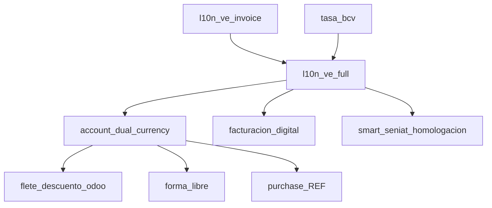

# Módulos Odoo 19 — Localización Venezolana y Homologación SENIAT

Este repositorio contiene un conjunto de **módulos para Odoo 19** orientados a la **localización contable venezolana** y la **homologación ante el SENIAT** (facturación electrónica, retenciones, control fiscal). Los módulos se encuentran en la carpeta `core/` y están desarrollados y mantenidos por *ContablesAG* y colaboradores (Smart Systems, Aecas, Binauraldev, entre otros).

> **Rama principal:** `V19` — los módulos están migrados y probados sobre Odoo 19.

---

## Estructura del repositorio

```
Homologacion/
├── addons/                # Documentación de los addons (este archivo)
├── core/                  # Código fuente de todos los módulos Odoo
│   ├── account_dual_currency/
│   ├── account_report_multi_currency/
│   ├── auditlog/
│   ├── bi_advance_hide_show_menu/
│   ├── coletilla_sin_credito_fiscal/
│   ├── conditional_invoice_actions/
│   ├── custom_expiration_text/
│   ├── delivery_warning_seniat/
│   ├── easy_product_referencia/
│   ├── facturacion_digital/
│   ├── flete_descuento_odoo/
│   ├── forma_libre/
│   ├── hide_confirm_button/
│   ├── l10n_ve_full/
│   ├── l10n_ve_invoice/
│   ├── my_custom_module/
│   ├── my_invoice_module/
│   ├── my_version_footer/
│   ├── precio_negativo/
│   ├── purchase_REF/
│   ├── restrict_product_storable_on_invoice_customers/
│   ├── smart_seniat_homologacion/
│   ├── tasa_bcv/
│   └── web_notify/
├── odoo.conf              # Configuración de la instancia Odoo
└── README.md
```

---

## Catálogo de módulos

### 🧾 Localización contable venezolana

| Módulo | Versión | Descripción |
|--------|---------|-------------|
| **l10n_ve_invoice** | 19.0.1.0.0 | Base de la localización venezolana: plan de cuentas, configuración de diarios y grupos de facturación. |
| **l10n_ve_full** | 19.0.1.0.0 | **Localización completa de Venezuela**: retenciones de ISLR (conceptos, tasas, comprobantes), retenciones de IVA, retención municipal, libros fiscales (ventas, compras, inventario), libro resumen, estados y municipios/parroquias, configuración de documentos y plantillas de correo. |
| **account_dual_currency** | 19.0.0.0 | **Contabilidad dual**: Bs como moneda principal y $ como secundaria. Tasa individual por factura y asiento, conciliación total/parcial, registro de pagos con tasa diferente, anticipos con saldo a favor en ambas monedas, informes de seguimiento, reportes en $ (vencidas, libro mayor), valoración de inventario y retención de IGTF. |
| **account_report_multi_currency** | 19.0.1.0 | Reportes financieros contables en la moneda indicada (multi-moneda). |
| **tasa_bcv** | 19.0.0.0 | Actualización **automática de la tasa de cambio desde el BCV** mediante cron programado. |
| **forma_libre** | 19.0.0.0.0 | Formato de impresión personalizado para **facturas forma libre** (con soporte dual de moneda). |

### 📤 Facturación electrónica / SENIAT

| Módulo | Versión | Descripción |
|--------|---------|-------------|
| **facturacion_digital** | 19.0.1.0 | **Facturación digital con Smart-Factura Digital** para Odoo 19: botones de "Factura Digital" y "Re-Enviar F. Digital", pestaña de facturación digital, secuencias y configuración por empresa/diario. Migrado de Odoo 17 (ver `CHANGELOG.md`). |
| **smart_seniat_homologacion** | 19.0.0.0 | Módulo para la **homologación ante el SENIAT** en Odoo 19. |
| **delivery_warning_seniat** | 19.0.1.0 | **Notificación al SENIAT**: gestión de la fecha de cierre fiscal con advertencias y plantillas de correo. |
| **web_notify** | 19.0.1.0.0 | Notificación del **periodo SENIAT** a los usuarios mediante mensajes/notificaciones en el backend. |

### 🛠️ Utilidades y restricciones de negocio

| Módulo | Versión | Descripción |
|--------|---------|-------------|
| **auditlog** | 19.0.1.0.0 | Registro de **auditoría**: bitácora de cambios (crear/escribir/eliminar) sobre los registros, con cron de depuración y menús de consulta. |
| **bi_advance_hide_show_menu** | 19.0.1.0 | **Ocultar/mostrar menús, botones y acciones** según permisos: crear, editar, borrar, duplicar, importar, exportar, imprimir, reportes, submenús y campos. |
| **coletilla_sin_credito_fiscal** | 19.0.1.0 | Agrega una **coletilla** a ciertos documentos impresos indicando que **no otorgan derecho a crédito fiscal**. |
| **conditional_invoice_actions** | 19.0.1.0.0 | Muestra el botón de **acciones en facturas solo para usuarios autorizados** (grupo: "Habilitar botón de acciones"). |
| **easy_product_referencia** | 19.0.1.0 | Agrega un **campo de referencia en `product.template`** y mejora la búsqueda de productos. |
| **flete_descuento_odoo** | 19.0.1.0.0 | **Flete + Descuento**: calcula impuestos globales después de insertar líneas en Ventas, Compras y Factura; mantiene asientos de impuestos en cuentas configuradas y actualiza el PDF. |
| **hide_confirm_button** | 19.0.1.0 | Oculta el botón de **Confirmar** en los Pedidos de Venta. |
| **my_invoice_module** | 19.0.1.0 | Hace **no editable el campo de impuestos** en las líneas de factura. |
| **precio_negativo** | 19.0.1.0 | **Restricción de montos y cantidades negativas** en facturas y órdenes de pedido (precio unitario/cantidad). |
| **purchase_REF** | 19.0.1.0 | Agrega el campo **REF** para la conversión de Bs a $ en la línea de compra y la **autorización de precios mayores**. |
| **restrict_product_storable_on_invoice_customers** | 19.0.1.0.0 | **Restricción de productos** en las facturas de clientes. |
| **custom_expiration_text** | 19.0.1.0 | Agrega un **banner de neutralización** (versión de Odoo) al layout web. |
| **my_custom_module** | 19.0.1.0.0 | Muestra un **banner personalizado** en la interfaz de usuario. |
| **my_version_footer** | 19.0.1.0 | Agrega la **información de la versión de Odoo** en el footer de la vista de configuración. |

---

## Instalación

1. Clona el repositorio y coloca (o apunta) la carpeta `core/` en el `addons_path` de tu instancia Odoo 19.
2. Configura `odoo.conf` con, al menos:

   ```ini
   [options]
   addons_path = <ruta_al_repositorio>/core
   ```

3. Reinicia el servicio de Odoo y actualiza la lista de aplicaciones (`Actualizar lista de aplicaciones`).
4. Instala los módulos desde el menú **Aplicaciones** según la necesidad:

   - Localización completa de Venezuela: `l10n_ve_full`
   - Contabilidad dual (Bs/$): `account_dual_currency`
   - Facturación electrónica SENIAT: `facturacion_digital` / `smart_seniat_homologacion`
   - Tasa BCV automática: `tasa_bcv`

---

## Orden de instalación recomendado

Los módulos tienen dependencias entre sí. El orden lógico para una instalación desde cero es:



> **Nota:** `account_dual_currency` requiere `l10n_ve_full`; `flete_descuento_odoo`, `forma_libre` y `purchase_REF` dependen de `account_dual_currency`.

---

## Notas

- Todos los módulos están versionados para **Odoo 19** (prefijo `19.0`).
- `facturacion_digital` fue migrado de Odoo 17 → 19; el historial de cambios detallado está en `core/facturacion_digital/CHANGELOG.md`.
- Licencias variadas por módulo (LGPL-3, AGPL-3, OPL-1, GPL-2, OEEL-1 y propietarias) — consulta el `__manifest__.py` de cada módulo.
